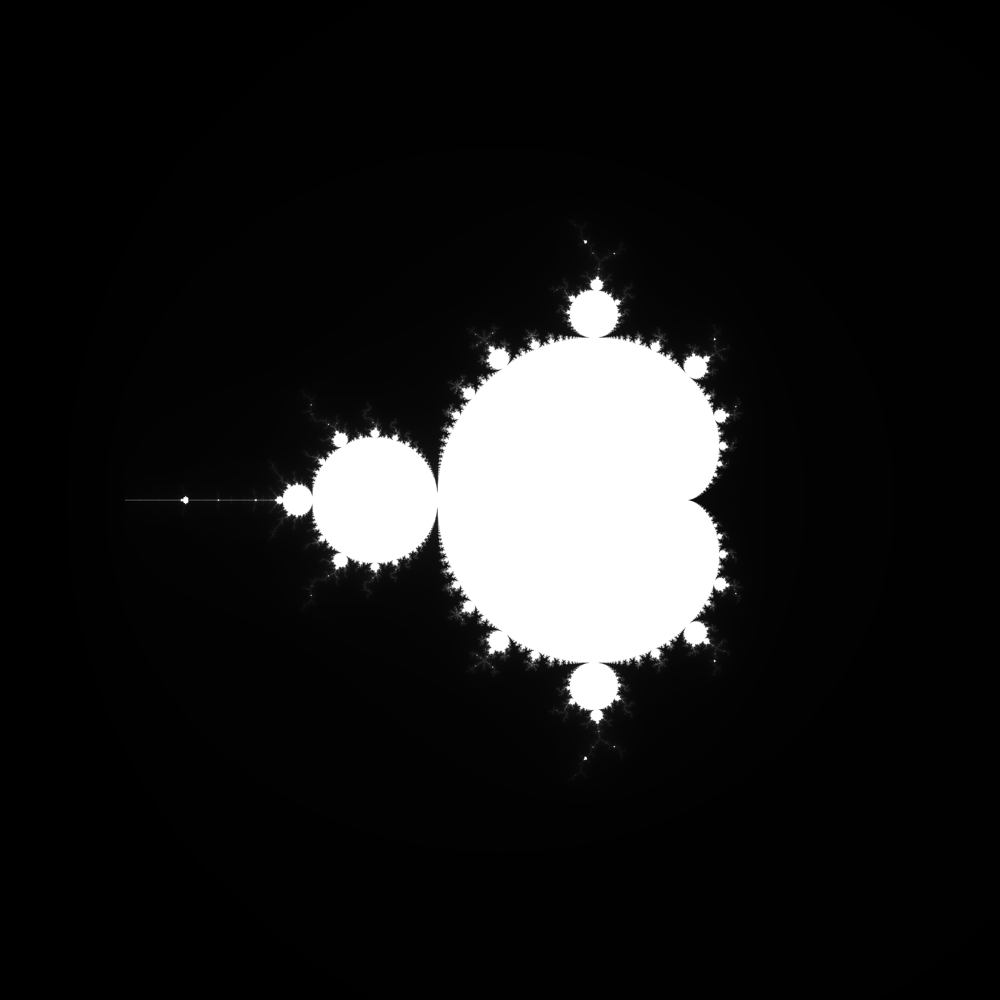
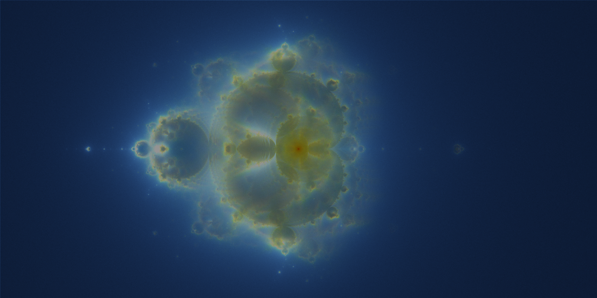
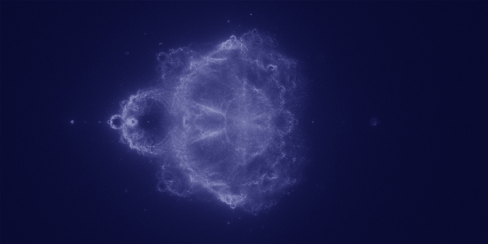

# Mandelbrot

Mandelbrot and related fractal rendering.

## `/mandelbrot`

Realtime visualization of the mandelbrot set.

### Usage

```bash
cd ./mandelbrot

# If you have a CUDA gpu
make cuda
# or use cpu
make cpu

# generate image
python main.py image --width 4096 --height 4096

# use pygame interactively
python main.py live --width 1280 --height 720

# change kernels
python main.py --kernel cpu
```

### Options

- `mode`: `image` or `live`.
- `--kernel`: `cpu` or `cuda` to set computing kernel. GPU is usually faster.
- `--width`: Width of viewing window or generated image.
- `--height`: Height
- `--max-iters`: Max iters to simulate function. More iters is slower but more accurate.



## `/buddhabrot`

Render the [buddhabrot](https://en.wikipedia.org/wiki/Buddhabrot)

### Usage

```bash
cd ./buddhabrot

make cpu

# generate buddhabrot
# Args are [iters] [samples]
./a.out 1000 10000000
python convert.py out.img buddhabrot.png

# generate nebulabrot
# calls a.out, convert.py, nebula.py many times.
./nebula.sh
```



